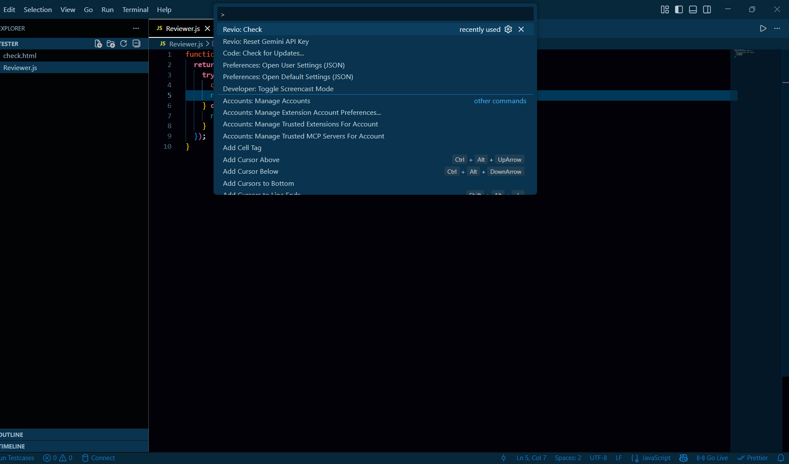
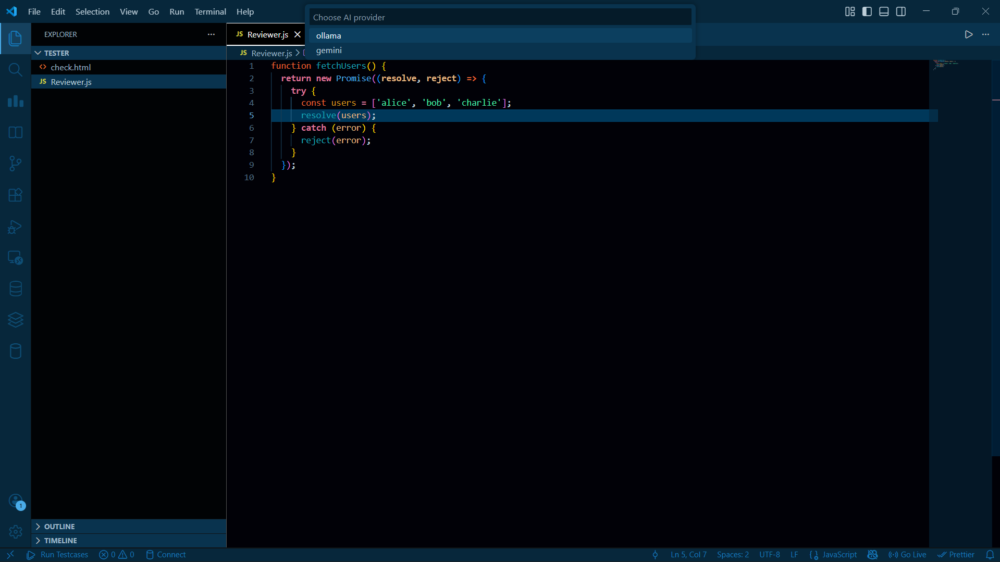
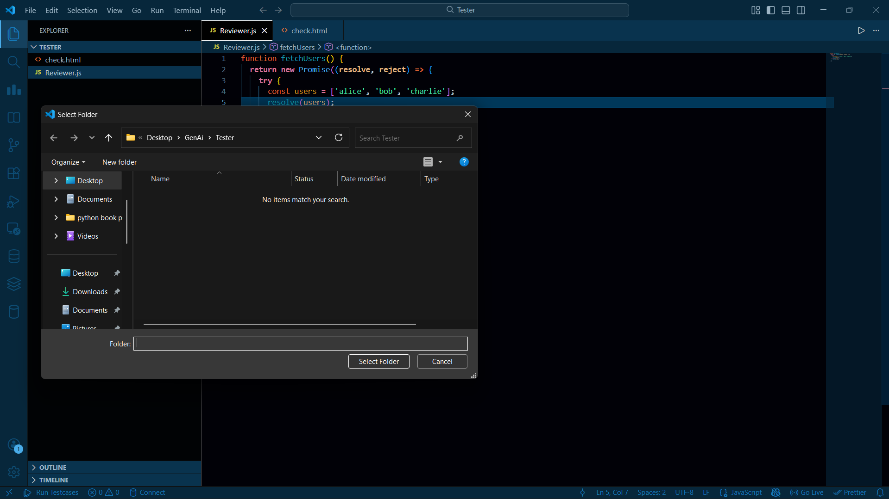
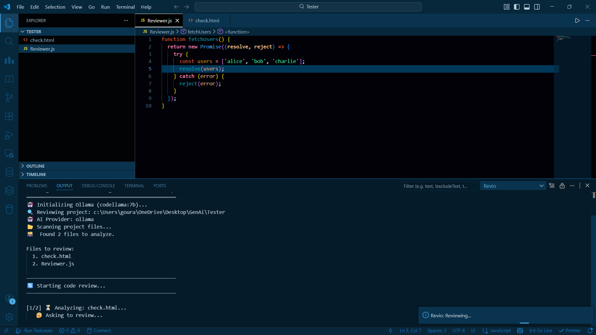

# Revio – AI Code Reviewer

Revio is an AI-powered code reviewer extension for Visual Studio Code.  
It helps you analyze and improve your code using AI models like **Gemini** and **Ollama**.

---

## ✨ Features
- AI-based code review inside VS Code
- Supports **Gemini** (cloud-based)
- Supports **Ollama** (local models)
- Simple command-based usage
- Works with most programming languages

---

## 🚀 How to Use

1. Open a project or file in VS Code
2. (Optional) Select the code you want to review
3. Open the Command Palette  
   **Ctrl + Shift + P**
4. Run the command:  
   **Revio: Check**
5. Choose your AI provider (Gemini or Ollama)
6. Enter your API key if prompted
7. Get AI-generated feedback and suggestions

## 🔑 API Key Setup

### Gemini
- You will be prompted to enter your Gemini API key on first use
- The API key is stored securely in VS Code settings
- You can reset it anytime using the command below

### Reset Gemini API Key
Open Command Palette and run: Revio: Reset Gemini API Key

### Ollama
- Install Ollama on your system
- Make sure Ollama is running locally
- No API key is required

---

## ⚙️ Available Commands

| Command | Description |
|-------|------------|
| Revio: Check | Reviews the current file or selected code |
| Revio: Reset Gemini API Key | Clears the saved Gemini API key |

---

## 🛠 Requirements
- Visual Studio Code version **1.90.0** or higher
- Internet connection for Gemini
- Ollama installed and running for local model support

---

## How It Works

### Step 1: Open Command Palette
Press `Ctrl+Shift+P` (or `Cmd+Shift+P` on Mac) and type **"Revio: Check"**

### Step 2: Select AI Provider
Choose between Ollama or Gemini

### Step 3: Select Folder
Choose the folder you want to review

### Step 4: Watch the Magic!
View progress in the Output panel (View → Output → select "Revio")

---

## 📦 Release Notes

### 0.0.1
- Initial release
- AI-powered code review
- Gemini and Ollama support
